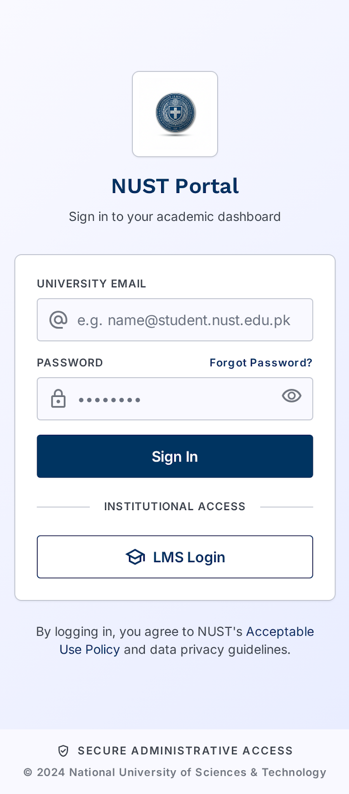
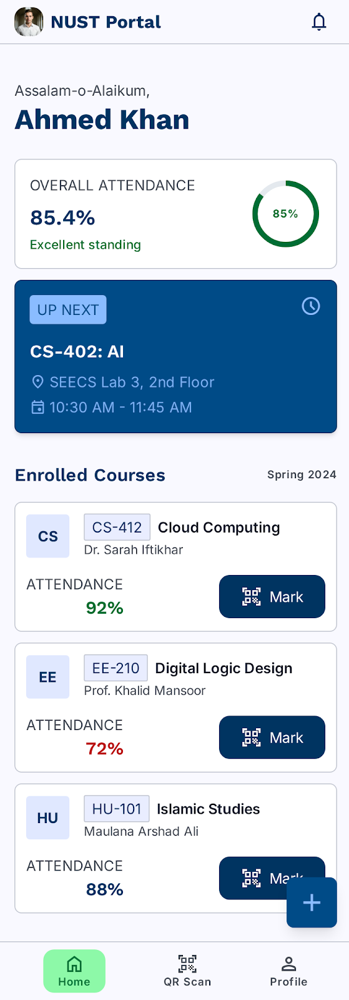
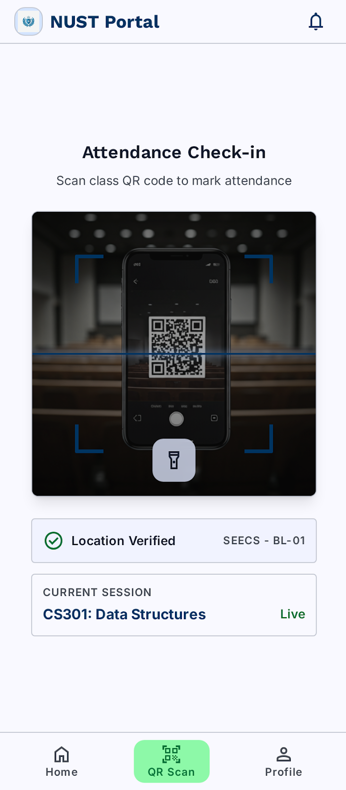
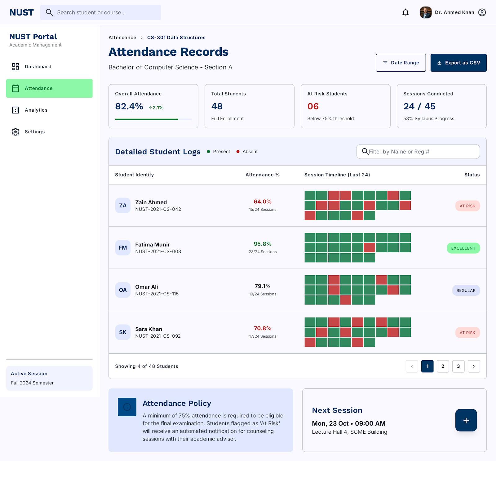
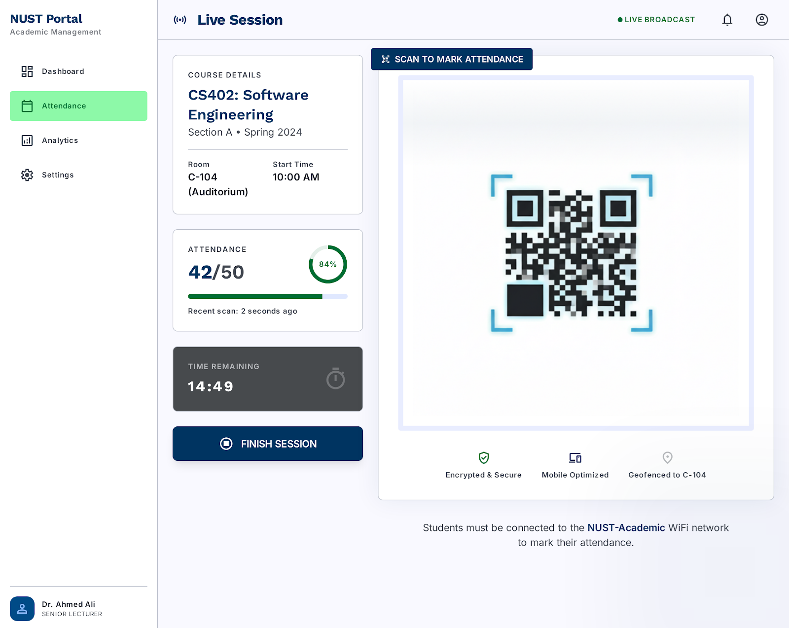
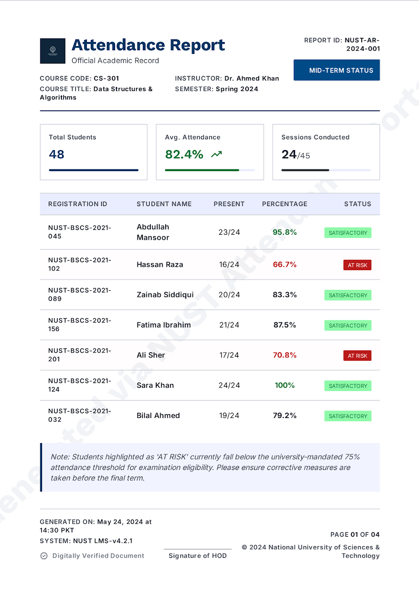

# Design Thinking Project Submission
## DST511S — Group Project Prototype Pitch 2026
**Faculty of Computing and Informatics — NUST**
**Due:** 29 May 2026

---

## 1. Problem Statement

Attendance tracking at tertiary institutions is largely manual. Lecturers pass around paper registers, call out names, or rely on students to sign in — processes that are slow, error-prone, and easy to manipulate.

This problem affects:
- **Students** — who may be marked absent despite attending, with no way to prove otherwise
- **Lecturers** — who spend valuable class time on admin and struggle to maintain accurate records
- **Administrative staff** — who receive incomplete or inconsistent data from lecturers

The design challenge we defined was:

> *How might we create a fast, reliable, and tamper-resistant attendance system that works within the existing infrastructure of a resource-constrained institution?*

---

## 2. Empathise Phase

To understand the problem, we conducted interviews with students, lecturers, and administrative staff at NUST. Participants were recruited using a structured consent process (see `consent.md`) and interviewed using a standardised guide (see `interview_questions.md`).

### Key Findings

**From Lecturers:**
- Paper registers are the most common method — they take 5–10 minutes at the start of every class
- Register sheets are frequently misplaced or handed in late to admin
- There is no reliable way to dispute a student's claim that they attended
- Several lecturers expressed interest in a digital system but were concerned about complexity

**From Students:**
- Students reported that it is easy for a friend to sign in on their behalf
- Some students have lost attendance marks due to registers being lost
- Students want visibility into their own attendance record
- Concern was raised about fairness — if proxies are easy, the system rewards dishonesty

**From Administrative Staff:**
- Collating attendance data from multiple lecturers is time-consuming
- Data received is inconsistent in format
- There is no central system — everything is paper-based or ad-hoc spreadsheets

### Summary
The empathy research confirmed that the problem is systemic: the process is manual, fragile, and easy to abuse at every point — from the classroom to the admin office.

---

## 3. Define Phase

From the empathy data, we identified three core pain points:

| # | Pain Point | Who It Affects |
|---|---|---|
| 1 | Attendance is easy to fake (proxy signing) | Lecturers, Admin |
| 2 | Records are lost or inconsistently submitted | Admin, Students |
| 3 | Students have no visibility into their own attendance | Students |

**Problem Statement:**
> Manual attendance systems at NUST are slow, unreliable, and trivially easy to manipulate — resulting in inaccurate records, administrative burden, and unfair outcomes for students.

---

## 4. Ideate Phase

We explored three solutions before arriving at the final design.

### Idea 1 — NFC Card System ❌ Rejected
**Concept:** Issue every student an NFC-enabled ID card. Place NFC readers at the entrance of every classroom. Students tap in as they enter.

**Why we rejected it:**
- NUST has approximately 10,000+ students — reissuing cards institution-wide is prohibitively expensive
- Hundreds of NFC readers would need to be purchased and installed across all venues
- Hardware maintenance and replacement adds ongoing cost
- The same infrastructure cost would be repeated at every institution that adopted the system
- **Verdict: Not cost-effective at scale.**

---

### Idea 2 — QR Code Linked to Google Docs ❌ Rejected
**Concept:** Generate a QR code per class that links to a Google Form. Students scan it and fill in their student number to mark themselves present.

**Why we rejected it:**
- No authentication — any student can enter any student number
- A student can share the link with someone not in the class
- Completely spoofable: one person could submit attendance for the entire class
- No device binding or location data — no way to detect abuse
- **Verdict: Easy to build but provides no security or integrity guarantees.**

---

### Idea 3 — Authenticated QR Attendance System ✅ Selected
**Concept:** A full-stack system where students register with verified accounts, and attendance is captured by scanning a class-specific QR code that is cryptographically signed. The system includes device binding, geolocation capture, and fraud detection.

**Why this works:**
- Students must register with their student number and email — accounts are verified
- Each class gets a unique HMAC-signed QR token — it cannot be forged or reused across classes
- An optional challenge code (announced verbally by the lecturer) prevents remote scanning
- Device fingerprinting detects when multiple accounts are used from the same device
- Geolocation is recorded at submission — students must be physically present to submit
- All records are stored in a central database accessible to lecturers and administrators

This solution directly addresses all three pain points identified in the Define phase:
- Proxy attendance is prevented by device binding + challenge codes
- Records are digital, centralised, and never lost
- Students can view their own attendance history in the mobile app

---

## 5. Prototype Phase

The prototype is a working three-component system:

| Component | Technology | Audience |
|---|---|---|
| `attendance-server` | Deno, Oak, PostgreSQL | REST API backend |
| `attendance-web` | React, Vite, TypeScript | Lecturers + Admins |
| `attendance-mobile` | React Native, Expo | Students |

### Core Flow
1. Lecturer creates a class on the web portal — server generates a signed QR token
2. Lecturer prints the QR code and displays it in the classroom
3. Lecturer optionally sets a verbal challenge code (e.g., `BLUE42`)
4. Student opens the mobile app, scans the QR code
5. App prompts for the challenge code if required
6. App collects the student's geolocation and sends the attendance submission
7. Server verifies the QR signature, checks for duplicate submissions, checks for device conflicts, and records the attendance
8. Lecturer can view the attendance list on the web portal, download a PDF report, and push records to the institution's admin store

### Security Measures Implemented
- JWT authentication (15-minute access tokens, 7-day refresh tokens)
- AES-256-GCM encrypted device info header (`X-Device-Info`)
- HMAC-SHA256 signed QR tokens
- Device conflict flagging (non-blocking fraud detection)
- Mandatory geolocation on every attendance submission
- Duplicate submission prevention (`UNIQUE` constraint per student per class)

See `architecture.md` for the full technical specification.

### Screenshots — Student Mobile App

**Login Screen**

**Student Dashboard** — overall attendance, enrolled courses, and quick mark buttons

**QR Scan Screen** — live camera, location verified, current session shown

---

### Screenshots — Lecturer Web Portal

**Attendance Dashboard** — overall stats, at-risk students, session timeline heatmaps

**Live Session / QR Generation** — signed QR code displayed for students to scan, live attendance counter

**PDF Attendance Report** — exported report with student records, attendance percentages, and at-risk flags

---

## 6. Test Phase

The prototype was reviewed internally by the group and demonstrated to two student volunteers outside the team.

**Feedback received:**
- Students found the registration flow straightforward
- The QR scan-to-submit flow was intuitive — completed in under 30 seconds in testing
- One tester noted that the challenge code step was not immediately obvious — the UI prompt will be made clearer
- The web portal's attendance table was readable but would benefit from better mobile responsiveness

**Issues identified during testing:**
- The mobile app requires location permission to be granted before scanning — users need to be informed of this upfront
- The device encryption key must be baked into the mobile build — this needs a documented build process for the final release

---

## 7. Reflection & Next Steps

### What went well
- The empathy research clearly shaped the solution — each security feature maps directly to a pain point discovered in interviews
- The three-idea progression shows genuine design thinking: we did not jump to the first solution
- The architecture is production-ready in design, even if the prototype is not yet fully deployed

### What the prototype is still missing
- Full end-to-end deployment (the system runs locally via Docker but is not yet hosted)
- The admin push to the institution's external store is a stub — the real integration depends on NUST's API
- User testing beyond the internal group has been limited to two participants
- The mobile app encryption (`expo-crypto` AES-256-GCM) needs to be validated across iOS and Android builds

### Next Steps
1. **Deploy** the server and web portal to a cloud environment (e.g., Railway, Render, or a VPS)
2. **Publish** the mobile app as an Expo Go preview for broader testing
3. **Expand user testing** — at least one real lecturer and 10 students
4. **Integrate** with the institution's actual admin store endpoint
5. **Add** email verification on student registration to prevent fake account creation
6. **Build** an attendance dispute flow — allowing students to flag incorrect records for lecturer review

---

## 8. Team Roles

| Member | Role |
|---|---|
| Carlito De Almeida | Project Lead, Backend Architecture, Research |
| *(add team members)* | *(add roles)* |

---

## 9. Repository

All project files, architecture documentation, consent forms, interview guides, and source code are available at:

**https://github.com/branewyn/nust-dst-attendance**
